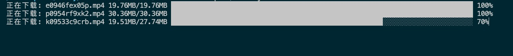

# download 

> 使用 nodejs 下载文件，[download](https://github.com/kevva/download) 所启发。

## 安装

> npm 不允许 @scope 类型的包名中含有单独的 download 字母，否则无法发布

```bash
npm i @onlymisaky/downloads
```

## 用法

## 单个文件下载

[examples/single-download.js](https://github.com/onlymisaky/download/blob/master/examples/single-download.js)

```js
// 下载到当前目录，根据 content-disposition 或 url 自动设置文件名
await download('https://avatars.githubusercontent.com/u/24823322');

// 下载到 download/images 下，如果文件夹不存在将自动创建
await download(
  'https://avatars.githubusercontent.com/u/24823322',
  'download/images'
);

// 下载到 download/images 下，并将文件命名为 avatar.png
await download(
  'https://avatars.githubusercontent.com/u/24823322',
  'download/images/avatar.png'
);

/**
 * 下载到 download/images 下，并将文件命名为 my-avatar 
 * 扩展名根据 MIME 类型判断生成
 * 当你确定要下载的文件类型，而又想设置文件名城时，可通过此方式实现
 */
await download(
  'https://avatars.githubusercontent.com/u/24823322',
  'download/images',
  {
    filename: 'my-avatar'
  }
);
```

## 多个文件下载

[examples/multiple-downloads.js](https://github.com/onlymisaky/download/blob/master/examples/multiple-downloads.js)

```js
const ids = [0, 1, 2, 3, 4, 5, 6, 7, 8, 9, 10];
const links = ids.map((id) => `https://avatars.githubusercontent.com/u/${id}`);

// 所有文件会下载到 download/images/avatars
await download(
  links,
  'download/images/avatars'
);

// 下载链接数组与 dest 目录数组一一相对应
// 0.png 下载到 download/images/avatars/0/0.png
// 1.png 下载到 download/images/avatars/1/1.png
await download(
  links,
  ids.map((id) => `download/images/avatars/${id}`),
);

// 通过函数创建下载目录
await download(
  links,
  (index, url) => `download/images/avatars/${index}-avatar.png`
);
```

## 多个文件分批次下载

[examples/multiple-batch-downloads.js](https://github.com/onlymisaky/download/blob/master/examples/multiple-batch-downloads.js)


```js
// 开始下载回调
// 该函数的返回值将会作为参数传给 onDownload 
function onStartDownload(ctx) {
  const { file, size, } = ctx;
  const progressBar = new ProgressBar(
    ` :title: ${file} :downloaded/${size.toString(2)} :bar :percent`,
    {
      complete: '█',
      head: '',
      incomplete: '░',
      width: 77,
      total: size.B * 1,
    }
  );
  return progressBar;
}

// 下载中回调
// 第三个参数为 onStartDownload 的返回值，默认为 undefined
function onDownload(chunk, ctx, progressBar) {
  const { downloaded } = ctx;
  progressBar.tick(chunk.length, {
    title: '正在下载',
    downloaded: sizeFormat(downloaded, 'B').toString(2),
  });
  if (progressBar.complete) {
    progressBar.render({
      title: '下载完成',
    });
  }
}

const links = [
  `https://apd-e96dba32198fd9a7ff658b2357efea61.v.smtcdns.com/om.tc.qq.com/A8hDaWf1osY5MDop3VsOp-IeUYRIMBOnVKoJeAi_XQ1o/uwMROfz2r5zEIaQXGdGnC2dfJ6norVr71SyOzMWdO4L-7R5f/e0946fex05p.p701.1.mp4?sdtfrom=v1103&guid=f5af37cdf07f1e1d560b5cd23e367c1e&vkey=FF0242DB2CB3240FDC60220B6A7A2CC267F9094144DF31D4371DEF31D0028FA5C20A1B6ACE59C11A266727D0E89F81C1D6EE9987316A0362A1C3F5B77620FFC5A26C7852577D1F9E3CA23B9D8C8BE901453F90CA3015924ABBD0AED6E0ABE64CC545A28F6FFEB35B9D67C9CC7CAC1C3402FEE98DF2359E7971E7D06A40EA7AC4CC58D639590295CA#t=66`,
  `https://apd-c0c9d0c4d2eed0099947e454c1d4d0c8.v.smtcdns.com/om.tc.qq.com/APDs9CNNE5GchhAu3vkv8c7-x5R--P6ExNhrWWMMNXio/uwMROfz2r5zCIaQXGdGnC2dfJ6nY7Lpd3nJnZkkgeq3pDuzz/p0954rf9xk2.p701.1.mp4?sdtfrom=v1103&guid=f5af37cdf07f1e1d560b5cd23e367c1e&vkey=6A1A6BA1B60288BA00A701E0A44D0B1DCAA5C9E3175E7E4B207A500CDA160E2679B4CE27013C203AAAB2C3DC38CDDFF79D2EE7334970D2CE33BC67A5B76C24445CFDE6952E4BD9EEF29A54166EFAAB0B20578895B7BE90F9D89C5FF384A7E750F5AA6D16D53693828F80DF03134F0B89ACCEB628FC9A5CF5AC51038244A80AA3141C0246BFA0D576`,
  `https://apd-f804c69e93dbfb096fd8ab29eace4d36.v.smtcdns.com/om.tc.qq.com/AXgd5ZrpwmFjMTNRQPWqw6CAJlPD5HA9SpP6MH_IV09k/uwMROfz2r5zEIaQXGdGnC2dfJ6norVr71SyOzMWdO4L-7R5f/k09533c9crb.p701.1.mp4?sdtfrom=v1103&guid=f5af37cdf07f1e1d560b5cd23e367c1e&vkey=7FD8CFCB6FB049E2F087CED1C3352C382F5FA459E976DC1E4A4AB3A67059D0B1F2253C92011CD51ED9CAFAD8D5C3E36290F760F723C087B9658803B64F4013BECACD556691830599938B5DDE105EEFECB8CDF4F1FE078589F1F524DD2F3865B1B7FD31D24A739C184FCC10A494A82CD574AC18C0BF3951352FC55D50378A4D66CB2179E7F56828A5`,
  `https://apd-2c12975cbda15c0a8b62e67ce22771d3.v.smtcdns.com/om.tc.qq.com/AFWgM5kxWm5Fovex9ntT7XqzfoMO6dTb-ouW2rExxyH4/uwMROfz2r5zCIaQXGdGnC2dfJ6nY7Lpd3nJnZkkgeq3pDuzz/b0951bo9gn4.p701.1.mp4?sdtfrom=v1103&guid=f5af37cdf07f1e1d560b5cd23e367c1e&vkey=AAB8FE1F40CC693ED8B696A82AE39549A436F7EE84118758D5E8BFDBD8BEF32FAABE6A415A7951706B18D9F82B426605F82332A460D860BE85802AFEC5E5278FCC51D7534CE41FD9872CC42EA27A7F5B911B859A71BF0918E683011DE6CDF1C95FCB07A3E0ABC4EB31F04F3FC1A729F2EE20C8B2C753FA27B09C99AC80A8499B0AA389D94F51CE5A`,
  `https://apd-f804c69e93dbfb096fd8ab29eace4d36.v.smtcdns.com/om.tc.qq.com/AK4kFPfiXi76JvUdzvkOkysCrcpDt4VCWFUJ5OvcLp-A/uwMROfz2r5zEIaQXGdGnC2dfJ6norVr71SyOzMWdO4L-7R5f/o09477tn9cc.p701.1.mp4?sdtfrom=v1103&guid=f5af37cdf07f1e1d560b5cd23e367c1e&vkey=46B752F97627A54D21C3A05C16338D5A9B90F6A1A1C6B16E8833ECD853D4CD2BD09A7C036C757E8C63E3DCA1A853D788E31BB8C25D9A6AF61899AF2DE31D68E6442CC53E5F82270443EE05544010FE4E9D01D6ACA75B4E2A17ED356163921F6E6954A79901CEFAACDD2DFC22605879FA0D2B885422DA437F7E1562250FA851410DA7ED353F05E91D`
];

// 依次下载，错误的下载不会阻塞后续下载任务
const result = await download(links, 'download/videos', {
  count: 1, // 设置每次下载文件个数，默认全部同时下载
  onStartDownload,
  onDownload,
});
```


## API

###  download(url, dest?, options?)

#### url

type: `string` | `string[]`

下载链接

#### dest

type: `string` | `string[]` | `(index: number, url: string) => string;`

default: `''`

可以是文件夹 `download/videos`，也可以是文件路径 `download/videos/1.mp4` 。

当传入的 url 为数组时，dest 数组，或 dest 方法返回的路径与 url 下载的文件一一对应。

当 dest 具体到文件名称时： `1.mp4` ，即使所下载的文件不是视频文件，也会将扩展名设置为 `.mp4` ，所以如果你只是想设置文件名称，而又不清楚所下载的文件是何种类型的文件，请通过 `options.filename` 来设置。

#### options

type: `object`

default: `{}`

通过 [axios](https://github.com/axios/axios) 创请求，所以 [AxiosRequestConfig](https://github.com/axios/axios#request-config) 的属性都可以传入，除此之外，还有一下这些属性：

##### count

type: `number`

default: `url.length - 1`

当传入的 url 为数组时，通过 count 设置每次同时下载的数量，默认全部同时下载

##### filename

type: `string`

用于设置下载文件的文件名称，当你不确定文件类型，而又想设置文件名时，可以通过设置此字段实现，该字段再设置文件名过程中优先级最高。

##### onStartDownload

type: `<T>(ctx: Ctx) => T`

default: `() => undefined`

下载文件前回调，你可以通过调用该函数创建一个 `customCtx` 传递给 `onDownload` ，这在某些连续操作的场景下很有用。

##### onDownload

type: `<T>(chunk: string | Buffer, ctx: Ctx, customCtx: T) => void`

default: `() => { }`

下载过程中的回调，如果你对 `fs.ReadStream` 有所了解的话，你完全可以把他当作 `readStream.on('data')` 的回调来使用。

##### Ctx
- path: 文件全路径
- file: 文件完整名称，包含扩展名
- size: 文件大小，这是一个内部封装的对象，你可以通过调用 `toString()` 方法来直接显示
- downloaded: 已下载的大小, 单位 byte
- response: 请求的完整响应 AxiosResponse<fs.ReadStream>
- stream: 正在写入的流 fs.WriteStream
