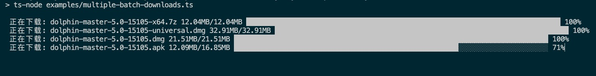

# download 

> 使用 nodejs 下载文件，受 [download](https://github.com/kevva/download) 启发。

## 安装

> npm 不允许 @scope 类型的包名中含有单独的 download 字母，否则无法发布

```bash
npm i @onlymisaky/downloads
```

## 用法

## 单个文件下载

[examples/single-download.ts](https://github.com/onlymisaky/download/blob/master/examples/single-download.ts)

```ts
// 下载到当前目录，根据 content-disposition 或 url 自动设置文件名
await download('https://avatars.githubusercontent.com/u/24823322');

// 下载到 download/images 下，如果文件夹不存在将自动创建
await download(
  'https://avatars.githubusercontent.com/u/24823322',
  'download/images'
);

// 下载到 download/images 下，并将文件命名为 avatar.png
await download(
  'https://avatars.githubusercontent.com/u/24823322',
  'download/images/avatar.png'
);

/**
 * 下载到 download/images 下，并将文件命名为 my-avatar 
 * 扩展名根据 MIME 类型判断生成
 * 当你确定要下载的文件类型，而又想设置文件名城时，可通过此方式实现
 */
await download(
  'https://avatars.githubusercontent.com/u/24823322',
  'download/images',
  {
    filename: 'my-avatar'
  }
);
```

## 多个文件下载

[examples/multiple-downloads.ts](https://github.com/onlymisaky/download/blob/master/examples/multiple-downloads.ts)

```ts
const ids = [0, 1, 2, 3, 4, 5, 6, 7, 8, 9, 10];
const links = ids.map((id) => `https://avatars.githubusercontent.com/u/${id}`);

// 所有文件会下载到 download/images/avatars
await download(
  links,
  'download/images/avatars'
);

// 下载链接数组与 output 目录数组一一相对应
// 0.png 下载到 download/images/avatars/0/0.png
// 1.png 下载到 download/images/avatars/1/1.png
await download(
  links,
  ids.map((id) => `download/images/avatars/${id}`),
);

// 通过函数创建下载目录
await download(
  links,
  (index, url) => `download/images/avatars/${index}-avatar.png`
);
```

## 多个文件分批次下载

[examples/multiple-batch-downloads.ts](https://github.com/onlymisaky/download/blob/master/examples/multiple-batch-downloads.ts)


```ts
// 开始下载回调
// 该函数的返回值将会作为参数传给 onDownload 
function onStartDownload(ctx) {
  return createBar(ctx.filename, ctx.size)
}

// 下载中回调
// 第三个参数为 onStartDownload 的返回值，默认为 undefined
function onDownload(chunk, ctx, progressBar) {
  tickBar(customCtx as ProgressBar, chunk.length, ctx.downloaded)
}

const links = [
  `https://github.com/citra-emu/citra-web/releases/download/1.0/citra-setup-mac.dmg`,
  `https://dl.dolphin-emu.org/builds/fd/c8/dolphin-master-5.0-15105-x64.7z`,
  `https://dl.dolphin-emu.org/builds/eb/fa/dolphin-master-5.0-15105-universal.dmg`,
  `https://dl.dolphin-emu.org/builds/e8/76/dolphin-master-5.0-15105.dmg`,
  `https://dl.dolphin-emu.org/builds/10/d8/dolphin-master-5.0-15105.apk`
];

// 依次下载，错误的下载不会阻塞后续下载任务
const result = await download(links, 'download/emu', {
  concurrent: 2, // 设置每次下载文件个数，默认全部同时下载
  onStartDownload,
  onDownload,
});
```


## API

###  download(url, output?, options?)

#### url

type: `string` | `string[]`

下载链接

#### output

type: `string` | `string[]` | `(index: number, url: string) => string;`

default: `''`

可以是文件夹 `download/videos`，也可以是文件路径 `download/videos/1.mp4` 。

当传入的 url 为数组时，output 数组，或 output 方法返回的路径与 url 下载的文件一一对应。

当 output 具体到文件名称时： `1.mp4` ，即使所下载的文件不是视频文件，也会将扩展名设置为 `.mp4` ，所以如果你只是想设置文件名称，而又不清楚所下载的文件是何种类型的文件，请通过 `options.filename` 来设置。

#### options

type: `object`

default: `{}`

通过 [axios](https://github.com/axios/axios) 创请求，所以 [AxiosRequestConfig](https://github.com/axios/axios#request-config) 的属性都可以传入，除此之外，还有一下这些属性：

##### concurrent

type: `number`

default: `url.length - 1`

当传入的 url 为数组时，通过 concurrent 设置每次同时下载的数量，默认全部同时下载

##### filename

type: `string`

用于设置下载文件的文件名称，当你不确定文件类型，而又想设置文件名时，可以通过设置此字段实现，该字段再设置文件名过程中优先级最高。

##### onStartDownload

type: `<T>(ctx: DownloadCbCtx) => T`

default: `() => undefined`

下载文件前回调，你可以通过调用该函数创建一个 `customCtx` 传递给 `onDownload` ，这在某些连续操作的场景下很有用。

##### onDownload

type: `<T>(chunk: string | Buffer, ctx: DownloadCbCtx, customCtx: T) => void`

default: `() => { }`

下载过程中的回调，如果你对 `fs.ReadStream` 有所了解的话，你完全可以把他当作 `readStream.on('data')` 的回调来使用。

##### DownloadCbCtx
- outputPath: 文件全路径
- filename: 文件完整名称，包含扩展名
- size: 文件大小，这是一个内部封装的对象，你可以通过调用 `toString()` 方法来直接显示
- downloaded: 已下载的大小, 单位 byte
- response: 请求的完整响应 AxiosResponse<fs.ReadStream>
- ~~stream: 正在写入的流 fs.WriteStream~~
